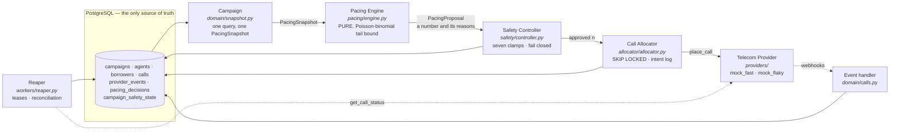
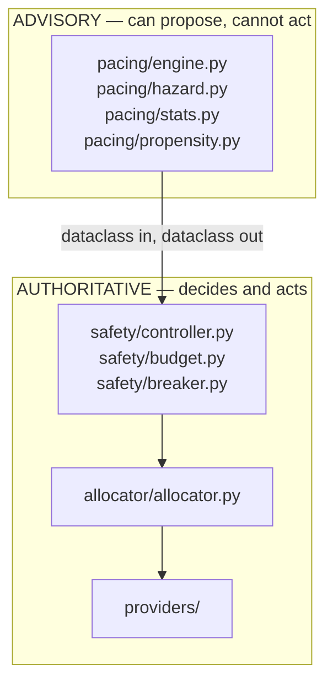
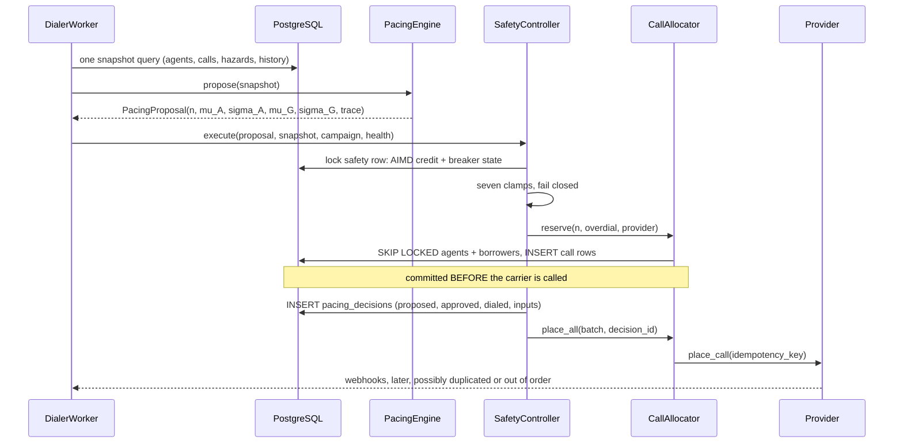

# Architecture

## The pipeline

The brief fixes this sequence, and the code follows it literally. Each arrow is
a plain function call; each box is testable on its own.

## The safety boundary

**The boundary is a fact about the import graph, not a promise in a docstring.**
`pacing/` imports nothing from `providers/`, `allocator/`, `core.db`, or
`psycopg`. `propose()` takes a `PacingSnapshot` and returns a `PacingProposal`.
It has no database handle, no provider handle and no allocator reference, so it
cannot place a call — there is nothing in scope with which to place one. This
is checked mechanically: `test_pacing_engine_has_no_forbidden_imports` parses
the AST of every module under `pacing/` and fails on any import that would
cross the line.

This is deliberately not implemented as signed tokens or runtime permission
checks. A runtime guard can be bypassed by whoever adds the next feature; a
dependency direction that a test enforces cannot be bypassed without the test
going red.

The Safety Controller is the only module holding a `CallAllocator`. Its clamps
are pure functions of measured state — agent counts, call counts, the
campaign's own policy row, the snapshot's age, abandoned calls, failed calls.
Not one of them takes an input the engine produces, except
`changepoint_detected`, which is the engine reporting that its own model just
broke and can only *reduce* the allowance.

## One tick

Ticks run at 250ms. Small batches at a high tick rate place the same number of
calls as large batches at a low one, with materially lower simultaneity — same
statistics, shorter customer wait.

## Processes

| Process | What it does | How many |
| --- | --- | --- |
| `DialerWorker` | tick loop + provider event handling | N per campaign |
| `Reaper` | leases, reconciliation, heartbeats | N (idempotent, so N is safe) |
| PostgreSQL | all state, all locking, all coordination | 1 |

The workers share nothing but the database. There is no leader, no lock
service, no cache, and no message bus. Two workers reaching for the same agent
is resolved by `SELECT ... FOR UPDATE SKIP LOCKED` inside one transaction, so
the question "the database says AVAILABLE but the cache says RESERVED — which
wins?" has no answer here: there is no second place for the answer to live.

## Where each requirement lives

| Requirement | Module |
| --- | --- |
| Agent state machine | `domain/agents.py`, `core/models.py` |
| Call state machine, ranks, dedup | `domain/calls.py` |
| Agent / borrower allocation | `domain/agents.py`, `domain/borrowers.py`, `allocator/` |
| Progressive dialer | `workers/dialer_worker.py` (mode PROGRESSIVE) |
| Predictive pacing | `pacing/engine.py`, `hazard.py`, `stats.py`, `propensity.py` |
| Safety Controller | `safety/controller.py` |
| Abandon budget, circuit breaker | `safety/budget.py`, `safety/breaker.py` |
| Mock providers | `providers/simulated.py`, `mock_fast.py`, `mock_flaky.py` |
| Crash recovery | `workers/reaper.py`, `workers/bridging.py` |
| Simulation | `sim/` |
| Load test | `loadtest/run.py` |
