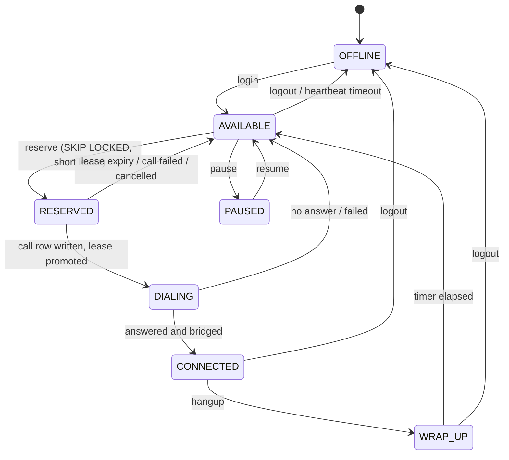
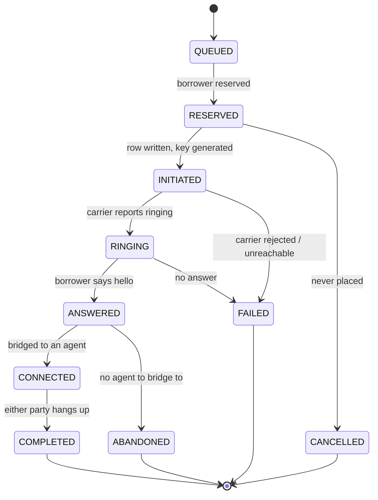

# State machines

Two machines, and they are guarded in completely different ways. The agent
machine is guarded by **compare-and-swap**: every transition names the version
and the state it expects, and a miss means somebody else moved the agent, so
we re-read rather than force the write. The call machine is guarded by
**rank monotonicity**: a call only ever moves forward, because the events that
drive it arrive from a carrier that does not promise order.

## Agent lifecycle



Two lease tiers, and the gap is deliberate. An agent `RESERVED` with no call
row behind them has nothing to reconcile, so the lease is 5 seconds: if the
worker holding them dies in the batch window they are back in the pool almost
immediately. Once a call row exists the lease is promoted to 30 seconds,
because reclaiming that agent now means asking the carrier what happened to
their call first, and reconciliation needs headroom to retry a slow provider.

**Two workers, one agent.** The reservation is a single statement:

```sql
UPDATE agents a
SET state = 'RESERVED', lease_owner = %(worker_id)s, version = version + 1, ...
WHERE a.id IN (
  SELECT id FROM agents
  WHERE campaign_id = %(campaign_id)s AND state = 'AVAILABLE'
  ORDER BY state_changed_at              -- longest-idle first: fair rotation
  FOR UPDATE SKIP LOCKED
  LIMIT %(n)s
)
RETURNING a.id, a.version;
```

`FOR UPDATE` takes a row lock inside the transaction. `SKIP LOCKED` means
worker 2 neither blocks nor errors — it silently steps over the rows worker 1
holds and takes the next available agents. The lock and the state write commit
together, so there is no window in which two workers both believe they own the
same agent. No application lock, no retry loop, no lock service.

Every other transition is a compare-and-swap:

```sql
UPDATE agents SET state = %(new)s, version = version + 1, state_changed_at = %(now)s
WHERE id = %(id)s AND version = %(expected_version)s AND state = %(expected_state)s;
-- 0 rows => somebody else moved it. Re-read and re-decide. Never force the write.
```

An illegal transition raises rather than being silently corrected. A dialer
that quietly repairs impossible states is a dialer whose state machine is
decorative.

## Call lifecycle



`ABANDONED` is not in the brief's list and is added deliberately. A borrower
who said hello and got nobody is a compliance event, and it must be
distinguishable from `COMPLETED` (we spoke to them) and from `FAILED` (we never
reached them). A dialer that records its abandons as failures optimises the
metric instead of the behaviour.

### Ranks

| State | Rank |
| --- | --- |
| QUEUED | 0 |
| RESERVED | 1 |
| INITIATED | 2 |
| RINGING | 3 |
| ANSWERED | 4 |
| CONNECTED | 5 |
| COMPLETED / FAILED / CANCELLED / ABANDONED | 9 |

All four terminal states share rank 9: a call that is over is over, whichever
way it ended, and nothing may move it afterwards.

## State is monotonic; facts are not

This is the single most important idea in the event path, and it is what
separates "I handled out-of-order events" from "I understood what naive
out-of-order handling costs me."

`apply_event()` runs in one transaction, in this order:

1. **Deduplicate.** `INSERT INTO provider_events ... ON CONFLICT (provider,
   provider_event_id) DO NOTHING RETURNING id`. No row returned means we have
   seen this event before: return immediately, cause no transition. This is
   what makes `ANSWERED, ANSWERED, ANSWERED, COMPLETED` produce one bridge.

2. **Absorb the facts, unconditionally.** Timestamps are written with
   `COALESCE(existing, incoming)` regardless of the call's current state:

   ```sql
   UPDATE calls SET
     ringing_at   = COALESCE(ringing_at,   %(ringing_ts)s),
     answered_at  = COALESCE(answered_at,  %(answered_ts)s),
     connected_at = COALESCE(connected_at, %(connected_ts)s),
     ended_at     = COALESCE(ended_at,     %(ended_ts)s)
   WHERE id = %(call_id)s;
   ```

3. **Advance the state, forward only.**

   ```sql
   UPDATE calls SET state = %(new)s, state_rank = %(new_rank)s, version = version + 1
   WHERE id = %(call_id)s AND state_rank < %(new_rank)s;
   ```

4. **Mark the event applied**, recording whether it caused a transition.

So `COMPLETED → ANSWERED → RINGING` settles at COMPLETED — and the late
ANSWERED still records `answered_at`.

That last clause is the point. Rank monotonicity alone would discard the late
event entirely, and `answered_at` is what the answer rate is computed from,
which is what the pacing engine predicts with. A dialer that handled
out-of-order events by rank alone would stay in a consistent state while
silently corrupting the statistic its predictions are built on, and it would
look correct the whole time.

## Where the two machines meet

An answered call needs an agent. The three-way decision lives in
`workers/bridging.py` and is shared by the worker and the reaper, so that a
crash-recovered answer is handled identically to a live one:

| Situation | Action |
| --- | --- |
| an agent is bound to the call | bridge them |
| no agent, but one is free | reserve and bridge |
| no agent, and none is free | `ABANDONED`, counted against the budget, hung up |

Nothing is allowed to reclassify the third case.
